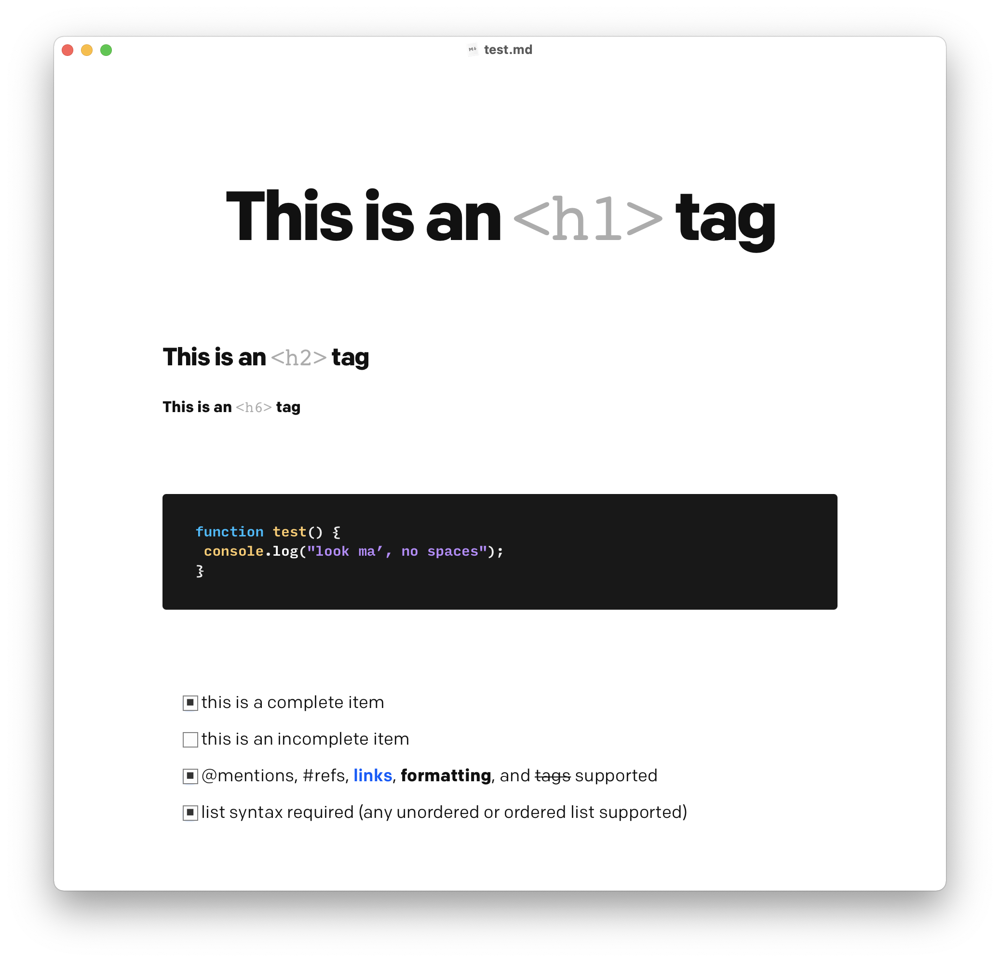

# Simple

🎨 A simple theme for Typora.

# Installation

1. Download this repository and unzip
2. Open the [Typora](https://typora.io/) application
3. In Typora's menu, select **File > Preferences**
4. Click the **Open Theme Folder** button
5. Move this repo's `simple.css` and `simple` folder into Typora's theme folder
6. Restart Typora
7. From the menu, select \*\*Themes > Simple

# Smart Quotes

To ensure that your files use the correct punctuation:

1. In Typora's menu, select **File > Preferences**
2. Under **Smart Punctuation**, check the **Smart Quotes** and **Smart Dashes** boxes
3. In the dropdown, select **Convert on Input**
